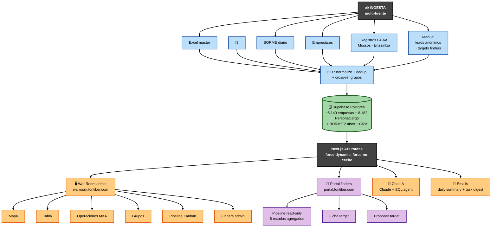
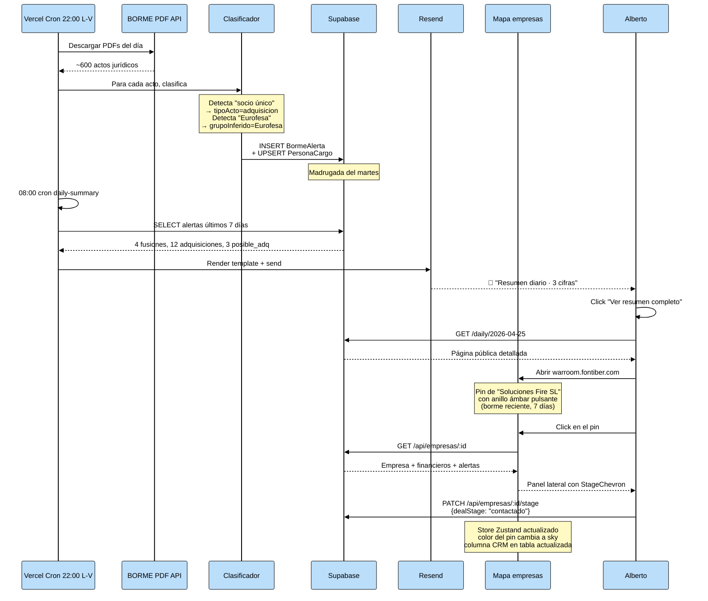
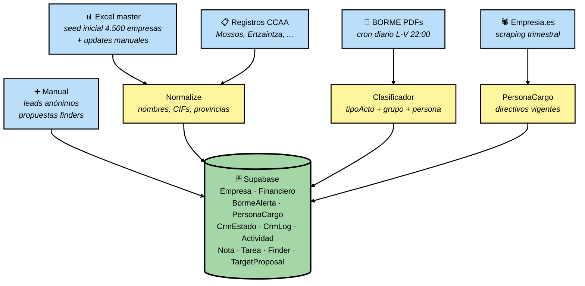
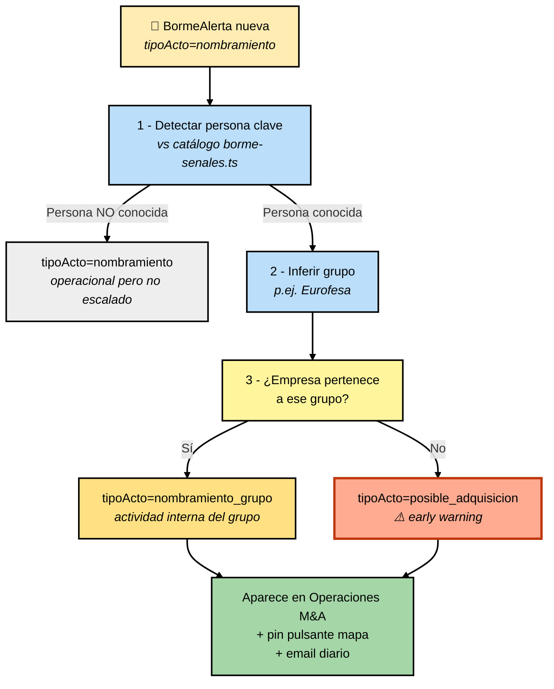
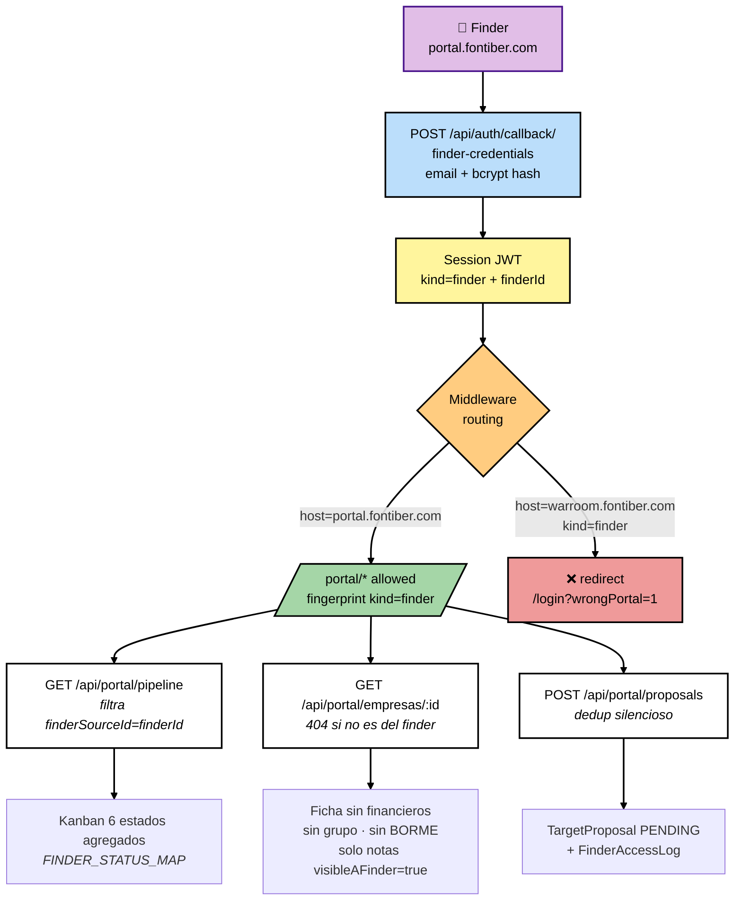
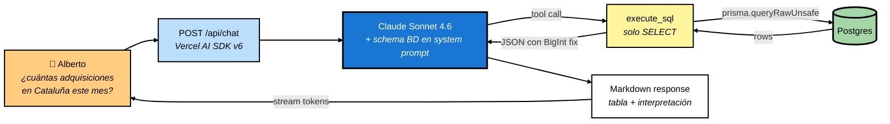
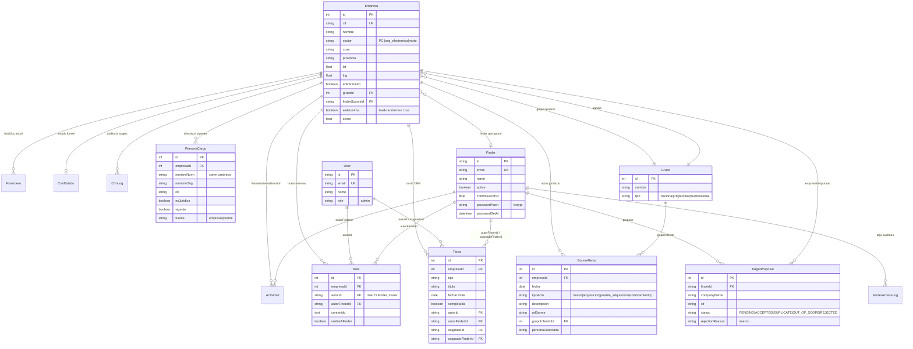

# War Room — Arquitectura explicada

> **Propósito:** explicar cómo funciona el sistema de forma accesible (no hace falta ser ingeniero), por qué cada pieza es necesaria, y qué mejoras tenemos planificadas.
>
> **Audiencia:** Alberto (decisiones estratégicas), inversores (entender el valor técnico del activo), y onboarding técnico futuro.
>
> **Cómo mantener este doc:** cada vez que añadamos/cambiemos algo arquitectural, actualizamos la sección relevante + la fecha + el changelog al final. Reglas concretas en §10.

---

## 1. Visión general en 60 segundos

**Qué es:** una aplicación web interna de **inteligencia M&A** para Fontiber Industrial Partners. Reúne en un solo sitio el universo de empresas españolas de PCI (Protección Contra Incendios) y seguridad electrónica, sus financieros, su actividad jurídica reciente (BORME), el estado de cada deal en el funnel, y un canal externo para que finders aporten nuevos targets.

**En qué se diferencia de Pipedrive / Excel / un CRM genérico:**

| | Pipedrive / CRM | Excel | War Room |
|---|---|---|---|
| Universo de empresas registradas | Solo lo que tú metes (~150) | Lo que un humano mantenga | **5.140** auto-curadas |
| Geografía interactiva | ❌ | ❌ | ✅ Mapbox + filtros geo |
| Señales BORME diarias | ❌ | ❌ | ✅ cron + clasificación M&A |
| Cross-referencing personas/grupos | ❌ | ❌ | ✅ PersonaCargo + grafo |
| Pipeline + funnel + actividades | ✅ | ❌ | ✅ + 9 stages + ventana 24h finders |
| Portal externo para finders | ❌ | ❌ | ✅ subdominio + bcrypt + aislamiento |
| Chat con la BD en lenguaje natural | ❌ | ❌ | ✅ Claude + SQL agent |
| Email digest diario / tareas | ⚠️ básico | ❌ | ✅ ambos automatizados |

**Dominio:** PCI + seguridad electrónica en España (~5.140 empresas). Sectores categorizados como `PCI`, `seguridad_electronica` o `mixto`. Cobertura geográfica completa de las 17 CCAA + Ceuta/Melilla.

**Contexto estratégico:** Fontiber Industrial Partners está activamente buscando targets de adquisición en el sector PCI / seguridad electrónica. El War Room es la herramienta operativa de la estrategia: detecta oportunidades, prioriza, ejecuta el funnel y captura inteligencia (BORME, financieros, perímetro). Es un activo replicable a otros sectores cuando se decida expansión.

---

## 2. Vista de pájaro — diagrama completo

### Diagrama 1 — Flujo principal (INGESTA + CONSULTA)

**Cómo leer el diagrama:**

- **INGESTA** (azul, arriba): cinco fuentes alimentan la BD. Una es automática y diaria (BORME); otras puntuales (Excel master, scraping empresia.es); otras manuales desde la propia app (leads anónimos, targets que aportan finders).
- **DB** (verde, centro): Supabase Postgres + Prisma. Es el único punto de la verdad. Todas las vistas leen de aquí.
- **CONSULTA** (naranja, abajo): seis vistas para Alberto/Gabriel + un portal completamente separado para los finders externos + Chat IA + emails automáticos.

**Tres mundos en un solo deployment Vercel:**

1. **War room admin** (`warroom.fontiber.com`) — vista completa con todo el universo, todos los financieros, BORME, grafo de personas, etc. Sólo Alberto y Gabriel (auth credenciales).
2. **Portal finders** (`portal.fontiber.com`) — subdominio paralelo. Cada finder solo ve sus targets asignados, nunca ve el stage interno real (sólo 6 estados agregados), nunca ve financieros ni grupo.
3. **Página pública diaria** (`warroom.fontiber.com/daily/YYYY-MM-DD`) — sin auth, generada por el cron diario para incluir en el email a stakeholders.

> 💡 **Un único Vercel deployment sirve los tres mundos.** El middleware (`src/middleware.ts`) detecta el host y redirige la zona portal a `/portal/*` internamente. Esto evita duplicar deploys y compartir código entre admin y portal donde tiene sentido (auth, schemas zod, normalize.ts).

---

## 3. El viaje de un caso real — paso a paso

Supongamos que el cron BORME del lunes a las 22:00 detecta una alerta sobre la empresa _"Soluciones Fire SL"_: cambio de socio único a favor de _Eurofesa Holding_. Veamos qué pasa.

**Qué ha pasado a nivel humano:**

1. **El cron detecta y enriquece** — el BORME publica ~600 actos jurídicos al día. El cron descarga los PDFs, parsea cada acto, detecta el tipo (`adquisicion`, `fusion`, `nombramiento`, etc.) y aplica el catálogo `borme-senales.ts` para inferir si una persona o keyword apunta a un grupo conocido (Eurofesa, Grupo Fire, Scutum, Attlon, Plana Fàbrega).
2. **Cross-product detection** — si un nombramiento mete a un directivo de _Eurofesa_ en una empresa que aún NO está en el grupo Eurofesa, lo marca como `posible_adquisicion`. Es el "early warning" más valioso del sistema: detecta movimientos antes de que la prensa los publique.
3. **Email diario** — el cron de las 8:00 agrega lo de los últimos 7 días en un email de tres cifras + link a la página `/daily/YYYY-MM-DD`.
4. **Pin pulsante en el mapa** — todas las empresas con `BormeAlerta` reciente (≤7 días) de tipo adquisición / fusión / posible adquisición tienen un anillo ámbar animado en el mapa. Imposible no verlas.
5. **Click → panel + cambio de stage** — Alberto abre la ficha, ve el contexto (financieros, BORME, alertas, tareas), pulsa el `StageChevron` para mover la empresa de _Identificado_ a _Contactado_. El cambio se persiste en BD pero **además** se sincroniza al instante con el store Zustand para que el color del pin y la columna CRM en la tabla cambien sin recargar.

**Tiempos típicos:** detección BORME → email Alberto = **una madrugada**. Click → panel cargado = **<1s**. Cambio de stage → propagación visual = **inmediato (sin refresh)**.

---

## 4. Los procesos clave en detalle

### 4.1 INGESTA — "construir el universo y mantenerlo vivo"

**Qué hace cada fuente y por qué es necesaria:**

**(1) Excel master** — el universo de partida (~4.500 empresas iniciales) viene de un Excel curado a mano por Alberto + datos públicos. Cada empresa entra con CIF, nombre, sector, perímetro, financieros plurianuales y opcionalmente grupo. Es la base de la pirámide.

> **Por qué un Excel y no scraping puro:** la curaduría inicial requiere juicio humano (qué es PCI puro vs mixto, qué empresas se incluyen en perímetro). El Excel captura ese juicio. Las actualizaciones puntuales (registros nuevos de CCAA, financieros nuevos) se hacen sobre el mismo Excel y se importan con un script.

**(2) Pipedrive — DEPRECADA (cut-over 2026-05-02)** — Fontiber gestionaba el funnel en Pipedrive antes del War Room. Hubo un cron diario de sincronización que se pausó en PR #47 (2026-05-01) y se eliminó el 2026-05-02 junto con todos los scripts y referencias en código (PR #59). En la Fase B (PR #60) se hizo backfill de `ownerUserId` desde el string legacy y se dropearon las columnas `CrmEstado.pipedriveOrgId`, `CrmEstado.owner` y `CrmLog.owner`. El CRM nativo (CrmEstado + CrmLog + Tarea + Nota) es ahora la fuente única de verdad.

**(3) BORME diario** — el Boletín Oficial del Registro Mercantil publica todos los días (L-V) los actos jurídicos del registro: constituciones, fusiones, adquisiciones, nombramientos, ceses, disoluciones. El cron a las 22:00 CEST descarga los PDFs del día (los del propio día — a esa hora ya están publicados completos), los parsea y clasifica.

> **Por qué importa:** las adquisiciones M&A se publican en BORME ANTES de que las anuncie la prensa (a veces semanas antes). Un sistema que vigila BORME a diario detecta movimientos en tiempo casi real. **Es el "early warning" estratégico del fondo.**
>
> **Concepto técnico: clasificación BORME.** El parser extrae el texto del PDF y aplica una cadena de heurísticas:
> 1. Palabras clave de fusión/escisión → `tipoActo=fusion`
> 2. "Socio único" / "unipersonalidad" / "cesión de participaciones" → `tipoActo=adquisicion`
> 3. "Cambio de denominación" → `tipoActo=cambio_denominacion` (señal de rebranding post-M&A)
> 4. "Nombramiento" + persona del catálogo `borme-senales.ts` → `tipoActo=nombramiento_grupo`. Si la empresa NO pertenece al grupo de esa persona, escala a `tipoActo=posible_adquisicion`.
> 5. "Cese" / "revocación" sin "nombramiento" → `tipoActo=otros` (reclasificación que aplicamos sobre el historial; ver `scripts/archive/reclasificar-ceses.ts`).

**(4) Empresia.es scraping** — base de datos pública española con directivos y administradores de cada empresa. Trimestralmente (próxima ronda: julio 2026) scrapeamos para actualizar `PersonaCargo` (8.182 registros vigentes en 2.583 empresas).

> **Por qué importa:** combinado con el catálogo de `borme-senales.ts`, `PersonaCargo` permite ver el grafo de personas: si Juan Pérez es administrador en 3 empresas y Eurofesa es socio único en 2 de ellas, hay una pista fuerte de que la 3ª también está en órbita Eurofesa. Esta detección es semi-manual hoy; el grafo visual es un siguiente paso del roadmap.

**(5) Registros oficiales por CCAA** — cada CCAA mantiene un registro propio de empresas de seguridad electrónica (Mossos en Cataluña, Ertzaintza en País Vasco, etc.). Cuando se publican actualizaciones, se incorporan al Excel master y se reimportan. Cataluña aportó +102 empresas, País Vasco +4. Pendientes: Andalucía, Madrid, Valencia.

**(6) Manual desde la app** — dos rutas:
   - **Leads anónimos**: Alberto/Gabriel pueden crear targets confidenciales (CIF placeholder `LEAD-{id}`, nombre = alias acordado). No aparecen en mapa/tabla/BORME, solo en `/pipeline`. Cuando se desvela la identidad real, el endpoint `POST /api/leads/:id/link` mueve todas las relaciones (notas, tareas, actividades, CrmLog) a la empresa real y borra el lead.
   - **Propuestas de finders**: el portal externo permite a finders proponer targets nuevos. El backend hace dedup silencioso (CIF exacto + nombre normalizado) y crea `TargetProposal` con `status=PENDING` para que admin lo revise.

**El normalizador (`src/lib/normalize.ts`) es la fuente única de verdad** para comparar nombres entre fuentes. Convierte _"Soluciones Fire, SL"_ y _"SOLUCIONES FIRE S.L."_ al mismo token canónico. Sin esto, una empresa aparecería duplicada cada vez que entra desde Excel + BORME.

---

### 4.2 CROSS-REFERENCING M&A — "convertir actos jurídicos en señales operacionales"

**Por qué este proceso es el corazón del valor del War Room:**

El BORME publica todo (constituciones, ceses, disoluciones, capital, fusiones…) sin filtrar. Hoy en bruto son ~600 actos/día — imposible vigilar a mano. La clasificación aprovecha **dos fuentes de conocimiento de Fontiber**:

1. **Catálogo de personas clave por grupo** (`src/lib/borme-senales.ts`):
   - Grupo Fire: 5 personas (Luciano Villen Marta, Zala Navarro Alejandro, Reyes Romero Luis Roberto, Guitard Maldonado Álvaro, De La Pascua Aragón Pablo)
   - Eurofesa: 4 (Bjurstrom Tor Filip, Fransson Bengt Olof Johan, Fransson Olof, Lopez Lopez David)
   - Scutum: Thierry Pascal Henri Babule + variantes + Turchi Pascal Lucien Elio Arthur
   - Attlon: Becker Lars + Urbon García Fuentes Iñigo
   - Plana Fàbrega: solo keywords de denominación / socio único (sin personas conocidas explícitas)

2. **Empresas ya asignadas a cada grupo** (`Empresa.grupoId`).

**El cruce de las dos = `posible_adquisicion`:**

> Si el catálogo dice "Bjurstrom es Eurofesa" y aparece nombrado en una empresa que no está marcada como grupo Eurofesa, el sistema escala el `tipoActo` a `posible_adquisicion`. **Esto es la señal accionable más fuerte:** el grupo está poniendo a su gente en el consejo antes de cerrar la operación oficial.

**Calibración del catálogo:** el catálogo se mantiene a mano (es información pública de cuentas anuales y prensa). Cada nueva contratación de Fontiber sobre un grupo conocido alimenta el catálogo. La incorporación de un grupo nuevo (p. ej. Eulen) requiere editar `borme-senales.ts` + re-clasificar el histórico (script en `scripts/archive/borme-backfill-grupos.ts`).

**Resultados (corte 2026-04):**
- 93 señales operacionales detectadas en el backfill de 2 años
- 41 adquisiciones por compradores externos (Serveo, Cajamarca, Dragados, Ilunion…) — útil para mapear la competencia
- 3 grupos propios crecieron por detección automática: Attlon (+3), Scutum (+4), Eurofesa (+1)

---

### 4.3 VISTAS DEL WAR ROOM — "navegación multi-eje del universo"

El war room admin tiene 5 vistas, cada una optimizada para una pregunta distinta:

| Vista | Pregunta que responde | Tecnología clave |
|---|---|---|
| **Mapa** | "¿Dónde está la actividad?" | Mapbox GL JS, clusters donut por stage CRM |
| **Tabla** | "Quiero filtrar/ordenar/exportar" | virtualización + sorting + Excel export |
| **Operaciones** | "¿Qué ha pasado en M&A esta semana?" | 3 sub-tabs (Señales, Personas, Actividad reciente) |
| **Grupos** | "¿Cómo se consolida cada grupo?" | tabla agregada de empresas/financieros por grupo |
| **Pipeline** | "¿En qué etapa está cada deal?" | Kanban arrastrable (dnd-kit) |

**Estado y filtros compartidos** (Zustand store `useWarRoomStore`):

- Las 5 vistas leen del MISMO `empresasGeoJSON` cargado al iniciar (~5.140 features). Cambiar de vista no recarga datos.
- Los filtros (CCAA, provincia, sector, grupo, stage CRM, perímetro, sliders financieros) se aplican client-side sobre los features. Resultado: filtros instantáneos sin round-trip al servidor.
- El sentinel `0` en `filtros.grupoId` representa "Sin grupo asignado". Permite filtrar empresas que NO pertenecen a ningún grupo conocido — útil para identificar candidatos a integrar en grupo propio.

**Sincronización store ↔ panel:** cuando Alberto cambia el stage / grupo / perímetro de una empresa desde el panel lateral, el endpoint persiste en BD **y** se llama a `updateEmpresaInGeoJSON(id, patch)` para parchear el feature en el store. Mapa y tabla se redibujan al instante sin recargar.

> **Decisión de diseño:** mantener todo el universo en memoria del cliente (~5.140 features ≈ 4MB) en vez de paginar. Trade-off: carga inicial ligeramente más larga, pero filtros / mapa / tabla son instantáneos y trabajan en modo "exploratorio" sin latencia. Para 50.000+ empresas habría que paginar; para 5.000 es óptimo.

#### Mapa — detalles técnicos

- **Dos fuentes GeoJSON** distinguibles: `empresas-bg` (no pasan filtros, gris opaco) declarada ANTES que `empresas` (las que pasan filtros). Z-order de Mapbox respeta el orden de declaración → los pins activos quedan encima.
- **Clusters como donut pie chart**: `clusterProperties` agrega contadores por stage (`s_id`, `s_ct`, `s_pr`, ...). La capa `clusters` nativa es transparente y un componente custom `ClusterPie` (Marker SVG de react-map-gl) dibuja el donut con la distribución real del cluster.
- **Anillo ámbar pulsante** (`borme-ring`): solo si la empresa tiene un BORME reciente (≤7 días) de tipo fusion/adquisicion/posible_adquisicion AND pasa los filtros activos. Atrae la atención sin saturar.
- **Jitter determinista**: `getJitter(cif, axis)` calcula un offset ±44m derivado del CIF para evitar que pins en la misma dirección se solapen exactamente.

---

### 4.4 PORTAL FINDERS — "extender el equipo sin filtrar inteligencia"

**Por qué un portal separado y no un rol "finder" dentro del war room:**

1. **Aislamiento de información** — los finders nunca deben ver financieros, owner interno, BORME, stage interno real, leads anónimos. Un rol dentro del war room implicaría filtros condicionales en cada componente; un sub-error filtra inteligencia. Subdominio + endpoints `/api/portal/*` separados garantizan que los datos sensibles **no salen del backend**.
2. **UX dedicada** — el finder no necesita 5 vistas; solo Kanban + ficha + form. Una UI simple para finders incrementa adopción.
3. **Auditoría limpia** — `FinderAccessLog` registra acciones del finder (view_deals, view_deal, add_note, propose_target, propose_target_duplicate). Si entrara por la app principal, las acciones se mezclarían con las de admin.

**Las cuatro reglas de no-leak (codificadas en endpoints `/api/portal/*`):**

1. **`finderSourceId === session.finderId` en todo query** — si la empresa no está asignada al finder, 404 (no 403 — no leak de existencia).
2. **`esAnonima=false` siempre filtrado** — los leads anónimos nunca aparecen en el portal.
3. **Stage interno → 6 estados agregados** — `FINDER_STATUS_MAP` mapea los 9 stages internos (incluido `LOI enviada`, `execution`) a 6 estados neutros (`Pendiente`, `Contactado`, `En negociación`, `Cerrado`, `En pausa`, `Descartado`). El finder no sabe si estás en LOI o en ejecución.
4. **Dedup silencioso de propuestas** — al proponer un target, el backend hace check (CIF + nombre normalizado). Si match → crea `TargetProposal` igualmente con `status=PENDING` (no auto-cierra). El admin ve un badge ámbar "Posible duplicado" calculado on-the-fly. El finder solo ve "Propuesta enviada" sin pista de si la empresa ya estaba registrada.

**Ventana de edición 24h:** el finder puede editar/borrar sus propias notas, tareas y actividades durante 24h desde su creación. Pasada la ventana → 403, debe añadir nuevas. Esto evita que se reescriba a posteriori una conversación con el fundador del target. Se implementa con `canEditWithin24h(createdAt)` en `src/lib/finder-session.ts`.

**Auth y gestión de credenciales:** los finders no tienen self-service de password ni email reset. El admin (Alberto/Gabriel) genera la password desde `/finders` (genera aleatorio o teclea), el endpoint hace bcrypt hash + verifica persistencia (relee el registro tras `update`) + devuelve `passwordSetAt` para que el cliente confirme la escritura. El admin pasa la password por canal seguro (WhatsApp/Signal). Cero superficie pública de gestión.

---

### 4.5 CHAT IA — "preguntar a la BD en lenguaje natural"

**Por qué un agente SQL y no RAG:**

- El War Room no tiene "documentos" que indexar. Tiene un schema relacional (~12 tablas) con datos transaccionales y agregables.
- Las preguntas son analíticas: _"empresas con EBITDA > 1M€ en Cataluña con BORME de adquisición en últimos 30 días"_. Un RAG estilo búsqueda semántica no puede contestar eso; SQL sí.
- Claude entiende SQL y razona sobre joins. Pasarle el schema completo en el system prompt + un único tool `execute_sql` cubre el 95% de queries útiles.

**Salvaguardas:**

1. **Solo SELECT** — el endpoint valida que la query no contiene `DROP|DELETE|UPDATE|INSERT|ALTER|TRUNCATE` antes de ejecutar.
2. **`prisma.$queryRawUnsafe`** — necesaria porque la query se construye dinámicamente. La validación previa la hace segura.
3. **BigInt serialization** — Prisma devuelve `COUNT(*)` como `BigInt`, que `JSON.stringify` no maneja por defecto. El endpoint usa un replacer custom.
4. **Horizonte temporal explícito** — el system prompt instruye a Claude a preguntar al usuario por el rango de fechas cuando la query implica datos temporales (BORME, financieros, CRM) y el usuario no especifica. Evita queries sin filtro que escaneen toda la BD.

**Montado en dos sitios:** `/` (war room admin) y `/pipeline` (con contexto CRM ampliado: User, Nota, Tarea, CrmEstado, CrmLog, Actividad, FinderSource, FinderNote, TargetProposal). El system prompt se pasa por `chat-schema.ts` con el DDL completo + reglas + ejemplos.

---

### 4.6 EMAILS Y CRONS — "trabajar mientras nadie está mirando"

| Cron | Schedule | Qué hace |
|---|---|---|
| `/api/cron/borme` | L-V 20:00 UTC (22:00 CEST) | Descarga BORME del día, parsea, clasifica, escribe `BormeAlerta` + upsert `PersonaCargo` |
| `/api/cron/daily-summary` | Ma-Sa 06:00 UTC (08:00 CEST) | Email a Alberto/Gabriel con 3 cifras + link a `/daily/YYYY-MM-DD` |
| `/api/cron/task-digest` | L-V 07:00 UTC | Email por usuario con sus tareas vencidas / hoy / próximos 7 días |

**Detalles operativos:**

- **Auth de los crons**: cada endpoint exige `Authorization: Bearer ${CRON_SECRET}`. Vercel inyecta el secret en sus invocaciones programadas. Si alguien llama el endpoint desde fuera sin el secret → 401.
- **Resend** (provider de email): instanciado dentro de cada función (no a nivel módulo). Las plantillas se generan inline; templates JSX/MJML serían sobre-ingeniería para 2 emails.
- **Página `/daily/[fecha]`** es **pública** (sin auth) — está en el matcher excluido del middleware. Permite que el email enlace directamente al detalle sin login.
- **Idempotencia**: BORME usa upsert/findFirst+update. Reejecutar el cron del mismo día no duplica datos.
- **El BORME procesa el día EN CURSO** (no el del día anterior). A las 22:00 CEST el BORME del día ya está completo y publicado.

---

## 5. Modelo de datos (qué vive dónde)

**Notas clave:**

- **`Empresa` es la tabla central**. Todas las relaciones cuelgan de ella. Single source of truth: nunca se borran empresas (salvo el caso especial de leads anónimos al vincularlos), solo se marcan `enPerimetro=false`.
- **Doble autoría en Nota / Tarea / Actividad / CrmLog**: cada registro tiene `autorId` (User admin) o `autorFinderId` (Finder), nunca ambos. Permite que admins y finders escriban en el mismo historial sin colisionar y mostrarse con badge distinto en el war room.
- **`visibleAFinder` en Nota**: por defecto `false` (las notas que escriben los admins son internas). Si el admin quiere compartir una nota con el finder asignado, marca `visibleAFinder=true`.
- **`PersonaCargo.nombreNorm`**: clave canónica generada por `normalizePersona()` — tokens ordenados alfabéticamente, sin partículas, sin tildes. Permite agrupar personas físicas con misma identidad aunque las fuentes escriban en orden distinto.
- **`BormeAlerta.tipoActo`**: 7 valores que codifican el tipo de evento M&A (ver §4.2). El más valioso: `posible_adquisicion`.
- **`TargetProposal.rejectionReason`**: campo interno NUNCA expuesto al finder. Lo escribe el admin al rechazar para auditoría.

**Migrations**: Prisma `db push` directo a Supabase (no migraciones formales). Trade-off: setup simple, pero requiere disciplina al cambiar el schema en prod (cambios siempre aditivos, columnas nullable o con default).

---

## 6. Auth y seguridad

### Dos providers en un único NextAuth (`src/lib/auth.ts`)

| Provider | Quién | Credenciales | Sesión |
|---|---|---|---|
| `admin-credentials` | Alberto, Gabriel | env vars `ADMIN_USER_*` + `ADMIN_PASS_*` | `kind: "admin"` |
| `finder-credentials` | Finders externos | email + bcrypt hash en tabla `Finder` | `kind: "finder"`, `finderId: <id>` |

Ambos viven en el mismo `NextAuthOptions`. El `jwt` callback guarda `kind` y `finderId` en el token; el `session` callback los pone disponibles en `useSession()`.

### Middleware (`src/middleware.ts`)

Detecta zona portal por **tres vías** (cualquiera basta):

1. Host = `portal.fontiber.com` (producción).
2. Path empieza por `/portal/*` o `/api/portal/*` (refuerzo defensivo, también en preview).
3. `?portal=1` o header `x-test-portal: 1` en `NODE_ENV !== "production"` (local dev).

**Reglas:**
- En zona portal: si `session.kind !== "finder"` → redirect `/portal/login`.
- En zona war room: si `session.kind === "finder"` → redirect `/login?wrongPortal=1`. (No queremos que un finder accidentalmente acabe en `/`.)

### Las 4 reglas anti-leak del portal

(repetidas aquí porque son críticas):

1. Todos los endpoints `/api/portal/*` filtran por `finderSourceId === session.finderId` AND `esAnonima=false`.
2. Stage agregado a 6 estados (`FINDER_STATUS_MAP`). Stage interno real nunca cruza el backend.
3. Dedup de propuestas silencioso: el finder no aprende si una empresa estaba registrada o no.
4. `rejectionReason` y notas con `visibleAFinder=false` nunca se devuelven al finder.

### Crons y secretos

- `CRON_SECRET` env var, comprobado con `Authorization: Bearer` en cada endpoint cron.
- Endpoints de cron sin el header válido → 401 (verificado tras incidente histórico de 500s).
- Resend, Anthropic, Mapbox tokens están en Vercel env, nunca hardcoded ni en el cliente (salvo `NEXT_PUBLIC_MAPBOX_TOKEN` que es el único de cliente — Mapbox tokens son revocables y se restringen por dominio en su dashboard).

---

## 7. Decisiones técnicas y trade-offs

| Decisión | Por qué | Trade-off aceptado |
|---|---|---|
| Next.js 14 App Router + RSC | Auth, middleware, rutas API, ISR/SSR — todo en un único framework. Vercel native. | Dependencia de Vercel para crons (alternativa: Cloudflare/Render). |
| Supabase Postgres + Prisma | Pgvector listo si se necesita; Postgres es robusto y conocido; Prisma tipa todo el stack. | Pooler tiene cold start ocasional (1-2s); aceptable para uso interno. |
| `prisma db push` (sin migraciones) | Setup simple, schema cambia poco en prod. | Cambios destructivos requieren coordinación manual. Plan B: introducir migrations cuando el equipo crezca. |
| Mapbox GL JS + react-map-gl | Mejor performance con 5k+ puntos, clusters nativos, estilos personalizados. | Coste por carga de mapa (gratis hasta 50k loads/mes; estamos cómodos). |
| Zustand (no Redux ni Context API) | API mínima, store global accesible, sin boilerplate. | No hay devtools tan ricos como Redux; la inspección via `devtools` middleware es suficiente. |
| Todo el universo en cliente (~5k features) | Filtros instantáneos, navegación fluida. | ~4MB en first load. Aceptable para uso interno con conexión decente. |
| Dos providers Credentials en un NextAuth (no dos NextAuth separados) | Compartir secret, callbacks, session shape. | Hay que llevar `kind` por todos lados; el middleware se ocupa. |
| Subdominio para portal (no rol dentro del war room) | Aislamiento de información imposible de filtrar mal por accidente. | Configuración DNS adicional; un middleware más en el deploy. |
| Chat IA con tool `execute_sql` (no RAG) | Las preguntas son analíticas, no documentales. | Riesgo de queries pesadas; mitigación: solo SELECT + horizonte temporal explícito en system prompt. |
| Dedup silencioso de propuestas | No revelar al finder qué tracker tenemos. | Marca DUPLICATE post-revisión filtra por separado en admin; admin ve badge "posible duplicado" on-the-fly. |
| Ventana edición 24h en portal | Evita reescritura tardía de historiales. | Si el finder se equivoca tras 24h, debe añadir nueva entrada. Aceptable. |

---

## 8. Roadmap / extensibilidad

### A corto plazo (próximas 1-2 sesiones)

- **Cut-over Pipedrive**: ✅ código limpio (PR #59) y columnas legacy dropeadas (PR #60) el 2026-05-02. Falta acción manual: export histórico a OneDrive y baja de suscripción.
- **Bug set-password en prod (PR #18 endurecido)**: si reaparece, hay logs nuevos para diagnosticar.

### A medio plazo (siguiente trimestre)

- **Scoring dinámico modular**: sub-scores por tamaño / rentabilidad / crecimiento / independencia / antigüedad / certificaciones / BORME / estructura directiva. Hoy hay un `score` calculado externamente; queremos pipeline transparente y editable.
- **Mapa de conexiones / grafo**: visualización del grafo de personas (PersonaCargo) compartidas entre empresas. Hoy se consulta vía la sub-tab "Personas compartidas" en Operaciones; pendiente la vista grafo (D3 o vis-network).
- **Fase 2 búsqueda webs**: 882 empresas en perímetro sin web. WebSearch dirigido (nombre + CIF) para las que la heurística no encontró.

### A largo plazo

- **Replicación a otros sectores**: el motor (ingesta + cross-ref + UI) es agnóstico al dominio. Cambiar el catálogo de grupos (`borme-senales.ts`) y la fuente de empresas (Excel) replica el sistema en otro sector. Pendiente: documentar playbook.
- **Registros oficiales otras CCAA**: Andalucía, Madrid, Valencia mantienen registros separados de seguridad electrónica.
- **Re-scraping trimestral empresia.es**: julio 2026.

### Deuda técnica

- `MapaEspana.tsx` (1130 líneas) → dividir en `useMapFiltering` hook + `<GeoJSONLayer/>` + `<MapHUD/>`. Refactor grande.
- ~~Deprecar `owner` (string legacy de Pipedrive) en favor de `ownerUserId`~~ ✅ hecho en PR #60 (Fase B del cut-over).
- Logger estructurado en lugar de `console.log` directos en crons / endpoints críticos.

---

## 9. Cómo se entrega y se opera

- **Repo**: https://github.com/albertofontiber/war-room (privado).
- **CI/CD**: push a `main` → deploy automático en Vercel (production) → propagación a `warroom.fontiber.com` y `portal.fontiber.com` en ~2 min.
- **Preview deploys** automáticos por cada PR. Vercel Preview Comments lista cambios visuales.
- **Tests**: vitest, 71 unit tests sobre `lib/crm`, `lib/format`, `lib/validation`. Lint con `npx next lint`. Typecheck con `npx tsc --noEmit`.
- **Observability**: Vercel Function Logs para errores en runtime; `FinderAccessLog` para auditoría de acciones de finders.
- **DNS**: dominios gestionados en GoDaddy (`fontiber.com`). Subdominios CNAME → `*.vercel-dns-017.com`.

---

## 10. Cómo mantener este doc

**Cuándo actualizarlo:**

- Cambios de arquitectura (nueva fuente de ingesta, nueva vista, nuevo provider de auth, nuevo subdominio, etc.).
- Cambios de modelo de datos visibles desde el cliente (campos nuevos en `Empresa`, nuevas tablas).
- Decisiones técnicas significativas (cambio de provider, refactor estructural).

**Cuándo NO actualizarlo:**

- Bugs puntuales (van al PR description y al changelog del repo).
- Tweaks menores de UI o copy.
- Renombrados internos sin impacto arquitectural.

**Reglas de redacción:**

1. Mantener la estructura: visión 60s → diagrama big picture → viaje paso a paso → procesos en detalle → modelo de datos → decisiones → roadmap.
2. Siempre **explicar el por qué** de cada decisión, no solo el qué. Ese es el valor añadido sobre el README/instructions.md.
3. Diagramas Mermaid en bloques con `
` para forzar fondo claro y que sean legibles tanto en VS Code como en GitHub.
4. Audiencia mixta: alternar entre lenguaje accesible y notas técnicas marcadas como `> **Concepto técnico:** ...`.
5. Cambios de fecha: actualizar la línea "Actualizado: ..." al inicio cuando se toque algo sustancial. No por cada commit.

**Changelog:**

| Fecha | Cambio | PR |
|---|---|---|
| 2026-04-25 | Doc inicial — refleja PRs #1-#23: war room core + MVP 1.5 portal finders + cleanup + ajustes UI | #24 |

---

*Última actualización: 2026-04-25*
